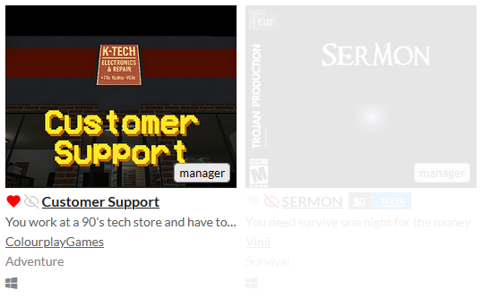
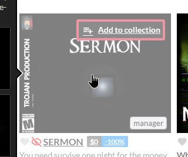

## About

https://github.com/ericchase/browserextension--improved-itch.io-collections-manager

An improved collections manager for https://itch.io/.

### Feature Set

Favorites Collection

- A default collection that adds a heart icon to each game cell and game page.
- Games in this collection will have red heart icons on their game cells.

Hidden Collection

- A default collection that adds an eyeball icon to each game cell and game page.
- Games in this collection will have red eyeball icons on their game cells, and their corresponding game cells will become transparent. When hovered, the transparency will temporarily lessen.

---



---



---

Collections Manager (WIP)

- Export button to save the collections database to a file.
- Import button to open an exported database file and merge the entries into the database.

## Build Tools V4

For information about my TypeScript library and Build Tools, please visit:

- https://github.com/ericchase-library/ts-library

## Project Disclaimer

This template may be updated from time to time.

## Setup & Usage

Setup and use the project as usual:

```bash
bun install
bun run build # full build
bun run dev # dev mode
```

## Copyright & License

**TL;DR:**

> This code is truly free and open source, licensed under the Apache 2.0 License. If you make a copy, _I humbly ask_ that you include the text from the `NOTICE` file somewhere in your project. **_You are not required to!_** You are also not required to include the original `LICENSE-APACHE` or `NOTICE` files, and I would prefer just a copy of the `NOTICE` file text or a link to this repository instead. You can use and modify this code however you like, including using a proprietary license for your changes. The only restriction I maintain is under clause 3 of the Apache 2.0 License regarding patents. If you find any potential license violations within any of my projects, please contact me so that I may resolve them.

A longer explanation can be found in the `README.md` file at https://github.com/ericchase-library/ts-library.
